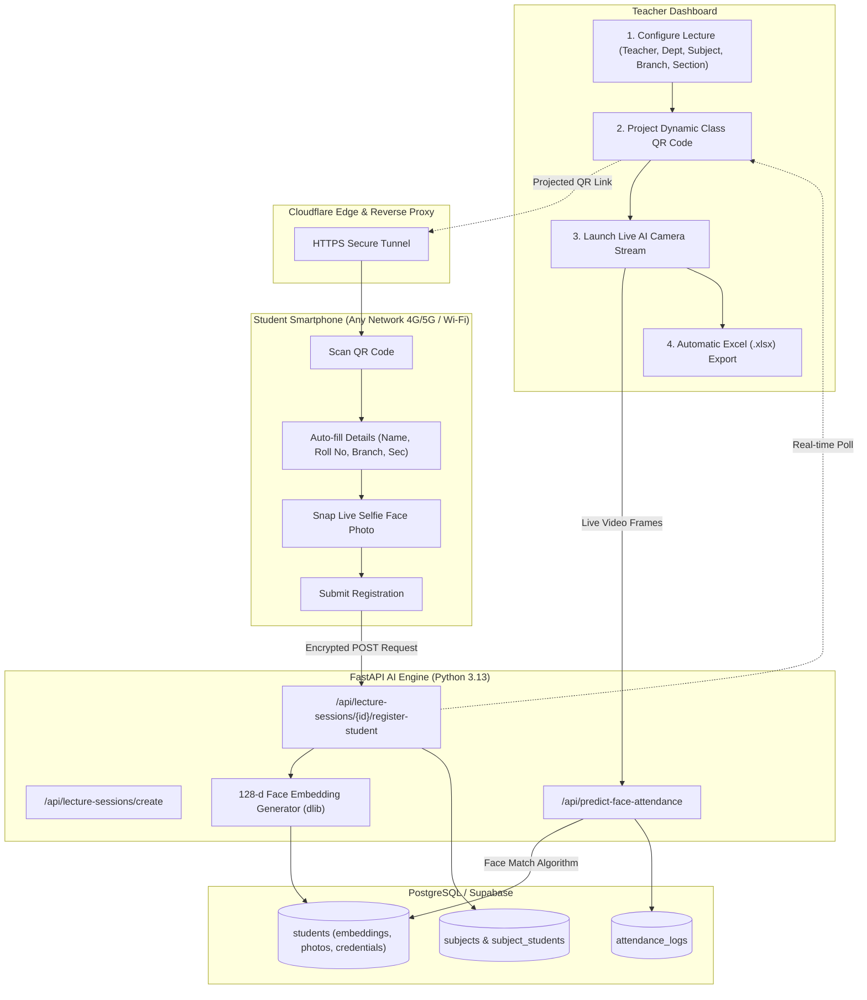

# 🎓 SnapClass AI - Next-Gen Smart Facial Recognition Attendance System

[](https://fastapi.tiangolo.com/)
[](https://react.dev/)
[](https://vitejs.dev/)
[](https://python.org/)
[](https://www.postgresql.org/)
[](https://cloudflare.com/)

**SnapClass AI** is a state-of-the-art AI-powered smart classroom attendance and analytics platform. Built with **FastAPI**, **Deep Face Recognition (128-d Biometric Embeddings)**, **React + Vite**, and **PostgreSQL**, SnapClass AI automates student verification, eliminates proxy attendance, and exports comprehensive semester-level attendance dossiers with a single click.

---

## 🌟 Key Features

### 1. ⚡ Two-Stage Smart Attendance Workflow
- **Stage 1 (Classroom Projection QR)**: Teachers configure the lecture details (Teacher Name, Faculty/Dept, Subject Name & Code, Branch, Year, Section) and project a dynamic QR code.
- **Stage 2 (Live AI Face Recognition Camera)**: Once students scan and register, the teacher launches live camera verification to mark attendance automatically in real-time.

### 2. 📱 Universal Mobile QR Registration (All Networks Supported)
- **Multi-Network Support**: Students can scan the QR code from **any network** — classroom Wi-Fi, mobile hotspot, or **cellular 4G/5G mobile data (Jio, Airtel, Vi)** via built-in Cloudflare tunnel reverse proxy.
- **Dedicated In-Class Card**: Scanning the QR code opens only the clean, focused student registration card (no extra dashboard clutter).
- **Selfie Biometric Capture**: Students snap a live selfie photo via their native smartphone camera.
- **Smart Memory Auto-Fill**: Student details (Roll No, Name, Branch, Section) are remembered locally on their device for 1-click registration in all future lectures.

### 3. 🤖 High-Accuracy Biometric Face Recognition
- Generates **128-dimensional facial embedding vectors** using deep metric learning (`dlib` + ResNet).
- Real-time frame analysis with multi-face detection, bounding boxes, and dynamic cosine similarity thresholding ($< 0.45$ distance).
- Instant model retraining on the fly whenever a new student joins the roster.

### 4. 📊 Dynamic Roster Querying & Verification
- Filter students dynamically by **Course**, **Branch**, **Class/Academic Year**, and **Section**.
- Matches detected student faces against enrolled roster entries:
  - 🟢 **Recognized in DB Roster** $\longrightarrow$ Marked **`PRESENT`**
  - 🔴 **Not Detected / Absent** $\longrightarrow$ Marked **`ABSENT`**

### 5. 📑 Automated Excel & CSV Export (.xlsx)
- **Single Lecture Session Report**: Generates structured `.xlsx` spreadsheets complete with S.No, Roll No, Student Name, Email, Course, Branch, Section, Attendance Status, **Verification Mode**, and **Exact Date & Timestamp**.
- **Cumulative Multi-Sheet Semester Dossier**:
  - *Sheet 1*: Cumulative summary with total lectures held, attended, missed, attendance percentage, and **75% eligibility shortage alerts**.
  - *Sheet 2*: Full lecture-by-lecture attendance timeline matrix.
  - *Sheet 3*: Raw detailed audit log trail.

---

## 🏗️ System Architecture



---

## 🚀 Getting Started

### 1. Prerequisites
- **Python 3.10+** (Python 3.13 recommended)
- **Node.js 18+** & `npm`
- **CMake & Visual Studio C++ Build Tools** (for `dlib`)
- **Git**

### 2. Clone the Repository
```bash
git clone https://github.com/sandeepsagar18/snap_class_AI_system.git
cd snap_class_AI_system
```

### 3. Backend Setup (FastAPI & AI Biometrics)
```bash
# Create and activate virtual environment
python -m venv venv
venv\Scripts\activate      # Windows
# source venv/bin/activate # Linux / macOS

# Install dependencies
pip install fastapi uvicorn dlib face_recognition pillow numpy supabase bcrypt python-multipart openpyxl
```

Configure your environment variables in `.env`:
```env
SUPABASE_URL=your_supabase_project_url
SUPABASE_KEY=your_supabase_anon_key
```

Run the backend server:
```bash
python -m uvicorn api:app --host 0.0.0.0 --port 8000
```

### 4. Frontend Setup (React + Vite)
```bash
cd frontend
npm install
npm run dev -- --host
```

Access the application in your browser:
- **Teacher / Student Portal**: `http://localhost:5173`
- **API Documentation**: `http://127.0.0.1:8000/docs`

---

## 📁 Project Structure

```
snap_class_AI_system/
├── api.py                          # FastAPI server & biometric AI recognition endpoints
├── src/
│   ├── database/
│   │   └── db.py                   # Supabase PostgreSQL database operations
│   └── models/                     # Deep learning face recognition models & embeddings
├── frontend/
│   ├── src/
│   │   ├── components/
│   │   │   ├── StartAttendanceConfigModal.jsx   # Pre-session teacher & subject configuration
│   │   │   ├── LectureQRRegistrationModal.jsx   # Dynamic QR projector & real-time roster sync
│   │   │   ├── StudentLectureJoinView.jsx       # Dedicated student mobile registration view
│   │   │   ├── CameraCapture.jsx                # Native mobile camera & webcam photo capture
│   │   │   ├── LiveSessionModal.jsx             # Live stream face detection & verification
│   │   │   └── AttendanceResultModal.jsx        # Snapshot attendance & override modal
│   │   ├── pages/
│   │   │   ├── TeacherDashboard.jsx             # Teacher control center & analytics
│   │   │   ├── StudentDashboard.jsx             # Student attendance portal & history
│   │   │   └── LandingPage.jsx                  # Main authentication landing page
│   │   └── lib/
│   │       ├── api.js                           # API client with automatic reverse proxy
│   │       └── excelExport.js                   # Multi-sheet semester Excel report generator
│   ├── package.json
│   └── vite.config.js
├── README.md
└── requirements.txt
```

---

## 🔒 Security & Privacy
- Face photos are converted into mathematical **128-dimensional embedding vectors**; raw image storage is optional.
- All communications are served over **HTTPS** via Cloudflare Tunnel encryption.
- Passwords and authentication hashes use **Bcrypt** cryptographic salt.

---

## 👨‍💻 Author & Contributions
Developed by **[Sandeep Sagar](https://github.com/sandeepsagar18)**  
*Contributions, issues, and feature requests are welcome! Feel free to check the [issues page](https://github.com/sandeepsagar18/snap_class_AI_system/issues).*

---

## 📜 License
This project is licensed under the MIT License.
